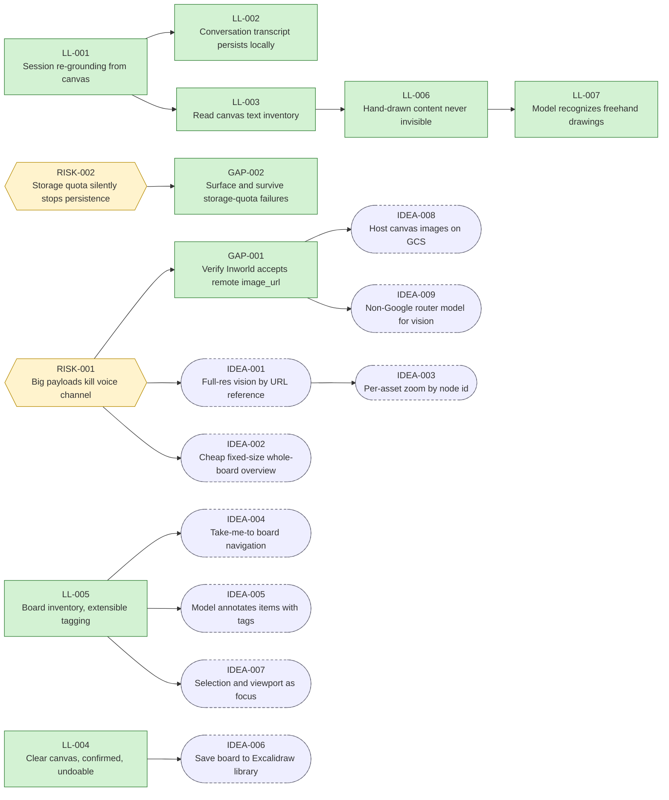

# Lineage Graph — Lumen Light (LL-)

Derived by Graphify from `REGISTER.md` — do not edit; regenerate with:
`node validate/graphify.mjs docs/REGISTER.md > docs/GRAPH.md`

Legend: rectangles = registered items, hexagons = risks, stadiums = ideas; green = built/supported, amber = concept/spec, dashed = idea, grey = deferred/superseded.
